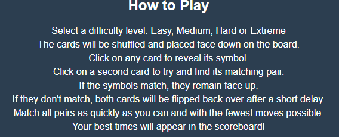
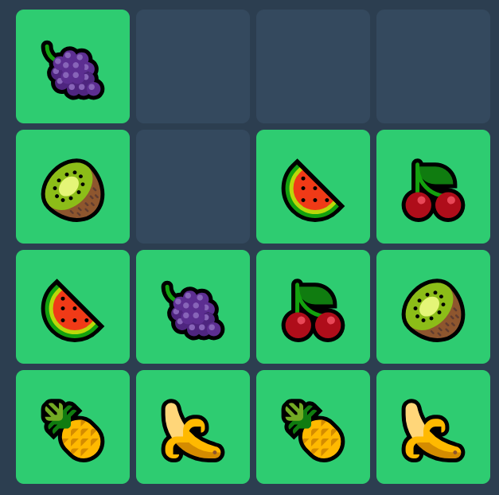
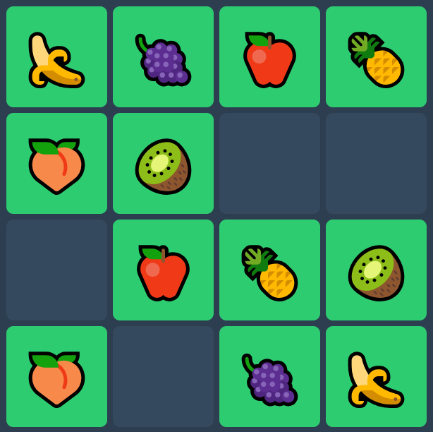
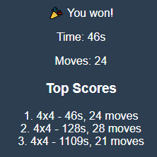
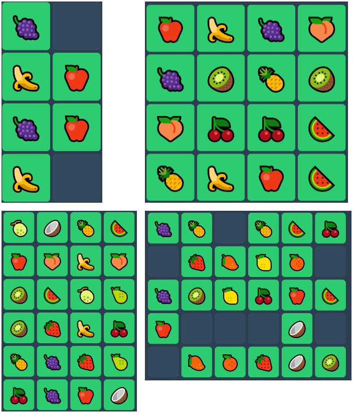
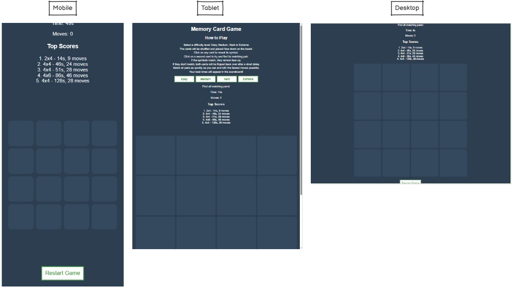
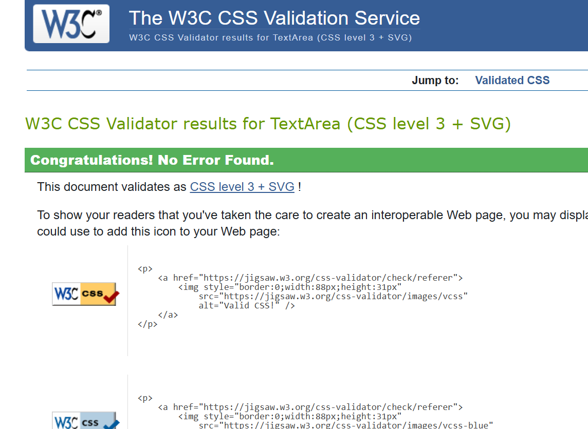

# Memory Card Game

A responsive, accessible, and fun emoji-based memory matching game built with **HTML, CSS, and JavaScript**.  
Match all pairs in the least number of moves and time possible — suitable for all devices!

🎮 **Live Site:** [Memory Card Game](https://h7qju7ts.github.io/memory-card-game/)

---

## Table of Contents
- [Description](#description)
- [User Stories](#user-stories)
- [Branding](#branding)
  - [Colour Theme](#colour-theme)
  - [Fonts](#fonts)
  - [Wireframes](#wireframes)
- [Features & File Structure](#features--file-structure)
  - [Home Page](#home-page)
  - [Gameplay](#gameplay)
- [Languages & Frameworks](#languages--frameworks)
- [Testing](#testing)
  - [Manual Testing](#manual-testing)
  - [HTML Validation](#html-validation)
  - [CSS Validation](#css-validation)
  - [JavaScript Validation](#javascript-validation)
  - [Lighthouse Testing](#lighthouse-testing)
- [Deployment](#deployment)
- [Credits](#credits)

---

## Description
The **Memory Match Game** challenges players to find all pairs of matching emoji cards.  
It includes multiple difficulty levels, a timer, move counter, scoreboard, and is optimized for desktop, tablet, and mobile.

---

## User Stories
### User Story 1
*"As a user I want an easy-to-play game with clear instructions."*

- Clear rules are displayed before starting.
- Simple controls: just click to flip cards.
- Works on all devices.

### User Story 2
*"As a user I want to track my performance."*

- Timer shows elapsed time.
- Move counter tracks efficiency.
- Scoreboard saves top 5 scores.

### User Story 3
*"As a user I want increasing levels of difficulty."*

- Easy: 6 cards  
- Medium: 12 cards  
- Hard: 20 cards  

### User Story 4
*"As a user I want a consistent and responsive design."*

- Same colour theme and fonts across all pages.
- Layout adapts seamlessly between desktop, tablet, and mobile.

---

## Branding

### Colour Theme
The design uses high-contrast colours for accessibility and readability.  
Examples:  
- Dark background for focus  

- Vibrant accent colours for cards and buttons  

### Fonts
- **Primary:** Inter  
- **Secondary (Headings):** Cal Sans  

### Wireframes
Initial wireframes created for **desktop, tablet, and mobile** views:  
- Desktop wireframe  

---

- Tablet wireframe

---

- Mobile wireframe  

---

## Features & File Structure

### Home Page
- Hero section with game introduction.  

- Start Game button with difficulty selection.  

### Gameplay
- Click to flip cards and find matches.  
 

---

- Timer and move counter displayed in real time.

 

---

- Randomized card layout for every new game.  
 

---

- Scoreboard saves the **Top 5 results**.  
 

### File Structure
- index.html -> Main game page
- style.css -> Styling
- script.js -> Game logic
- assets/images/ -> Mockups, icons

## Languages & Frameworks
- **HTML5** — Semantic structure  
- **CSS3** — Layout, animations, responsive design  
- **JavaScript (ES6)** — Game logic  
- **Flexbox & CSS Grid** — Layout management  

---

## Testing

### Manual Testing
- Verified all difficulty levels work.  

- Checked timer, move counter, and scoreboard across devices.  

- Tested responsiveness in Chrome DevTools.  

### HTML Validation

- **Result:** ✅ No errors  

### CSS Validation

- **Result:** ✅ No errors  

### JavaScript Validation

- **JSHint Result:** 68 warnings (unused vars/ES6 hints), 0 errors  

### Lighthouse Testing
**Desktop Scores:**  
- Performance: 100/100  
- Accessibility: 91/100  
- Best Practices: 100/100  
- SEO: 90/100  

**Mobile Scores:**  
- Performance: 91/100  
- Accessibility: 91/100  
- Best Practices: 100/100  
- SEO: 100/100  

---

## Deployment
The site was deployed using **GitHub Pages**.  

**Steps to deploy:**  
1. Push project to GitHub repository.  
2. Go to **Settings → Pages**.  
3. Under "Source", select **Deploy from branch**.  
4. Choose the `main` branch.  
5. GitHub generates a live link.  

---

## Credits

### Content
- All content written by the developer.  

### Imagery
- Emojis from the system Unicode set.  
- Mockups created with [Am I Responsive](http://ami.responsivedesign.is/).  

### Code
- Game logic inspired by common memory matching patterns.  
- Debugging and troubleshooting with **ChatGPT**.  
